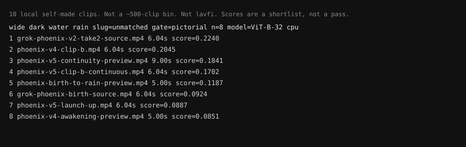

# binquery

Search large local footage folders with one editing intent. No uploads, no cloud vision API.

本機 CLI。一句剪輯意圖 → 8–15 條短名單（`path` / `score` / `gate` / `reasons`）。不是自動剪輯，不是 Premiere，不是 highlight。人還是要看。

## Install

Not on PyPI. Clone, then:

```
git clone https://github.com/jennifferweslowski-design/binquery
cd binquery
python3 -m venv .venv
.venv/bin/pip install -e .
```

Needs `ffmpeg` and `ffprobe` on PATH.

## Try it

Your own folder, or one long take. Nothing from this repo.

```
export BINQUERY_INDEX=./my-box
./binquery split --input ./long.mp4 --out ./split-out --seconds 8   # optional
./binquery index --input ./split-out --index "$BINQUERY_INDEX"      # or ./my-videos
./binquery doctor --index "$BINQUERY_INDEX"
./binquery query --index "$BINQUERY_INDEX" "worker and a vehicle in the same frame"
```

`doctor` prints `MISS` → stop. Query encodes the sentence only. First `index` may download OpenCLIP weights into a local cache (`~/.cache/binquery/open_clip`). That is not a query API.

Agent skill (instructions only, does not install the CLI):

```
npx -y skills add jennifferweslowski-design/binquery
```

## Hard limits

- Do not invent stars, downloads, user counts, or "validated at scale".
- Do not claim a ~500-clip real-bin run.
- Do not write `pip install binquery`.
- Keep existing honesty: not auto-edit, lavfi CI is mechanical, demo needs the user's own folder.

## 用法

```
export BINQUERY_INDEX=./my-box

./binquery split --input ./long.mp4 --out ./split-out --seconds 8
./binquery index --input ./split-out --index "$BINQUERY_INDEX"
./binquery doctor --index "$BINQUERY_INDEX"
./binquery query --index "$BINQUERY_INDEX" "<intent>" [--limit 12] [--out path.json]
./binquery list
```

已有影片資料夾就跳過 `split`，直接 `index --input ./my-videos`。

`split --input` 是一條本機長片。`--out` 要空目錄或新目錄（預設在長片旁邊的 `split-out`，不寫進程式樹）。`--seconds` 預設 8，夾在 4–60。預設 `-c copy`，切在 keyframe，時長不會剛好。可選 `--reencode`（本機 libx264 + aac）會比較接近目標時長。`split` 不建盒、不查詢。

`index --input` 是你自己的影片資料夾（split 出來的夾，或本來就有的夾）。`--index` 是盒根（會寫入 `index/`）。limit 預設 12，夾在 8–15。

`query` 用一句 pictorial 意圖回 8–15 條短名單。CLIP 看靜幀，長得像的會排在一起（例如白天岩縫透天，分數可以像月亮）。長片仍可能排高；時長是加分，不是硬切。人還是要看。這是短名單，不是自動剪輯。未對上凍結導演句也當 pictorial 跑，不必改 `src/intents.py`。

多場次就一場一句 `query`，查詢順序留給用戶當場次記憶（盒不會從檔案還原 Premiere 順序）。預告從 rushes 找鏡頭：對自己的 rushes 資料夾 `index`，再丟一句預告意圖。都不是貼進時間軸、也不是自動剪預告。

`doctor` 只檢查檔在不在、能不能讀。缺必備 index 就列檔名、exit 2，不假裝能查、不解包。真演示要本機長片先 `split` 再 index 成盒，或本機影片資料夾先 index 成盒（`BINQUERY_INDEX`）。CI 的 lavfi 30s → `split` 幾段再 `index` → `doctor` 只是機械檢查，不是實況 clipping 演示，也不是 rushes／場次序列演示。沒有對過約 500 條真 bin，也沒對真實況跑過。沒長片、沒盒就說：需要本機長片或影片資料夾先 index 成盒，才能演示。不要假裝對過真 bin。

## 自備盒

1. 影片放在你自己的資料夾，不要拷進這個倉庫。
2. 建盒：

```
export BINQUERY_INDEX=./my-box
./binquery index --input ./my-videos --index "$BINQUERY_INDEX"
```

會用本機 ffmpeg 每條抽 3 幀（約 1s／中點／結尾前 1s），再用本機 ViT-B-32 算向量，寫出：

- `index/clip.json`
- `index/clip_vectors.npy`
- `index/mechanical.json`
- `index/empty_hard.json`（`person_clip`：每條 max(cos 人 − cos 空)，空鏡 gate 直接讀。不必自己加 json。）
- `index/motion.json`（`motion_label`：lock／pan／handheld／moving；coarse 三幀幀差＋phaseCorrelate。查詢讀這份，不必自己加。）

3. 先 `doctor`，再 `query`。MISS 就停。
4. pictorial 不需要 person。空鏡 gate 用 `person_clip`。鏡頭運動用 `motion_label`（lock／pan／handheld）。
5. `.mov`、幀、向量留在盒裡。本倉庫只放程式和說明。`.gitignore` 已擋 `__pycache__`、`.venv`、`*.npy`、`*.mov`、`index/`。

## 例子

本機 10 條自有預覽（不是約 500 條真 bin，不是 CI lavfi）。`doctor` 0 之後：

```
./binquery query --index "$BINQUERY_INDEX" "wide dark water rain" --limit 8
```

分數是短名單，不是過關。人還是要看。



```
export BINQUERY_INDEX=./my-box
./binquery index --input ./my-videos --index "$BINQUERY_INDEX"
./binquery doctor --index "$BINQUERY_INDEX"
./binquery query --index "$BINQUERY_INDEX" "工人與車" --limit 12
```

凍結分數見 [test-run.md](test-run.md)（相對檔名，不含素材）。

未對上凍結句的場次名／預告意圖／clip 意圖也可以直接丟給 `query`（pictorial；不是實跑真 bin，也不是 highlight 偵測）：

```
./binquery query --index "$BINQUERY_INDEX" "scene 2 empty hallway lock-off"
./binquery query --index "$BINQUERY_INDEX" "第三場：傍晚空街遠景"
./binquery query --index "$BINQUERY_INDEX" "cold open wide empty night"
./binquery query --index "$BINQUERY_INDEX" "close-up reaction pause"
./binquery query --index "$BINQUERY_INDEX" "highlight reaction close-up"
./binquery query --index "$BINQUERY_INDEX" "talking to chat medium"
```

真演示要本機長片或本機盒。CI lavfi 不是這個演示。

## 禁止

雲端視覺查詢 API、unpack 素材進本倉庫、把影片或 index 向量提交上來。

## CI

推 `main` 或開 PR 時，[ci](.github/workflows/ci.yml) 在官方 runner 上 lavfi 自製 30s 測試圖案，`split` 成至少 2 段，再對那些段跑 `index` → `doctor`。素材和 index 只活在 runner，不進倉庫。那不是實況 clipping 演示，也不是 rushes／場次序列演示；真演示要用戶自己的長片或本機影片資料夾先建盒。

本機也可先用 lavfi 試 `split`（不是實況）：

```
ffmpeg -f lavfi -i testsrc=duration=30:size=320x240:rate=25 \
  -f lavfi -i sine=frequency=440:duration=30 \
  -c:v libx264 -pix_fmt yuv420p -c:a aac -shortest /tmp/long.mp4
./binquery split --input /tmp/long.mp4 --out /tmp/split-out --seconds 8
```

常見結果是 3 個檔、各約 10s（`-c copy` 切在 keyframe）。然後可 `index` 那個資料夾再 `doctor`。

怎麼提 issue／PR 見 [CONTRIBUTING.md](CONTRIBUTING.md)。

## Agent Skill

給 agent 用：一句剪輯意圖 → 本機短名單。裝這個倉庫的 Skill：

```
npx -y skills add jennifferweslowski-design/binquery
```

或把 `skills/binquery/` 拷進專案的 `.agents/skills/binquery` 或 `.claude/skills/binquery`（夾裡要有 `SKILL.md`）。

這只裝給 agent 的說明，不會裝 Python 套件。CLI 仍要 clone 後 `pip install -e .`。不在 PyPI，不要寫 `pip install binquery`。

場次很多、或預告要從自己的 rushes／dailies 找鏡頭：Skill 裡有未對上凍結句的示例意圖（一場一句，或一句預告意圖）。`query` 回 8–15 條短名單；查詢順序當作用戶的場次記憶。不是 Premiere、不是自動成片、沒有對真 bin 跑過。

一條長錄影要拆成可發的 clips：先 `split` 成資料夾（本機 ffmpeg 時間格，切在 keyframe），再 `index` 那個資料夾 → `doctor` → 一句「哪種 clip」查短名單。這是 **this kind of ask**（r/NewTubers, 2026-08-17: [How do small streamers handle clipping workflows](https://www.reddit.com/r/NewTubers/comments/1vqdvah/how_do_small_streamers_handle_clipping_workflows/)），不是 highlight 偵測、不是依靜音切、不是 YouTube/TikTok 自動 clip，也沒有對真實況跑過。演示要用戶自己的長片。
